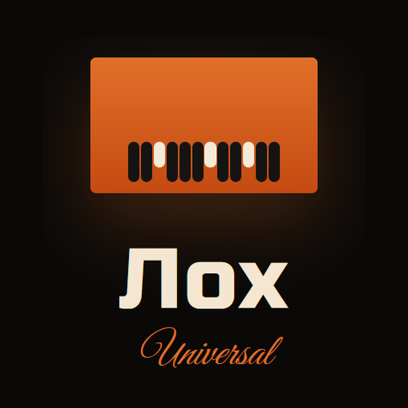

# Лох Universal

<p align="center">
  
</p>

**A freeware virtual transistor combo organ.**

Лох Universal is an instrument plugin. It recreates the sound of 1960s British **divide-down combo organs**: twelve top-octave oscillators feeding binary frequency dividers, mixed with drawbars, then shaped by flute/reed voicing, vibrato, percussion, a pedalboard of effects, a guitar-amp-style cabinet, and a rotary speaker.

It is **not** a sample library. Every note is synthesized.

Freeware by **Crimson Redstone**. GPL-3.0-or-later (required by JUCE).

> **Not a clone of any commercial product.** Not affiliated with, endorsed by, or connected to Korg Inc., Vox Amplification Ltd., Jennings Musical Industries, Hammond/Suzuki, Arturia, Steinberg, or any other manufacturer. “Combo organ” is a historical instrument category. See [github/DISCLAIMER.md](github/DISCLAIMER.md).

## What you get

| Format | Platform |
| --- | --- |
| **VST3** instrument | Windows, macOS, Linux |
| **AU** | macOS |
| **CLAP** | Windows, macOS, Linux |
| **Standalone** | Windows (WASAPI / DirectSound / ASIO via JUCE), macOS, Linux |

Load it in a DAW as an **instrument / synth**, or run the standalone.

## Sound engine

- 12 phase-locked top-octave oscillators and binary ÷2 dividers (the classic combo-organ architecture)
- Dual manuals on one 88-key on-screen keyboard (A0–C8); MIDI split and 3-channel modes
- Drawbars: 16′ 8′ 5⅓′ 4′ 2⅔′ 2′ 1⅗′ 1′ plus Mixture IV
- Four engines: **Model 301** (flute combo), **Super Combo** (brighter reed), **Saw Combo** (integrator), **Extended**
- Vibrato, percussion, key click, oscillator drift
- FX rack: overdrive, wah, chorus, phaser, delay, spring-style reverb
- Amp rack: Direct / Combo Cabinet / Rotary Speaker, with Drive, Bass, Treble, Cut
- 5-band post-EQ
- Skins: Default, Crimson, Nosmirc, Citrus Frost, Junkyard
- Factory presets plus **Save / Load `.lohpreset`**

## MIDI

| Control | CC |
| --- | --- |
| Upper 16′ … 1′ | 12–19 |
| Mixture IV | 20 |
| Flute / Reed | 21 / 22 |
| Vibrato depth (also enables vibrato) | 1 |
| Vibrato speed | 92 |
| Key click | 73 |
| Volume | 7 / 11 |
| Sustain | 64 |

Computer keyboard in the editor: **A = C3**. Hold Shift for the lower manual.

## Build it yourself

This repository is **source**. You compile it with CMake and JUCE 9.0.1 (fetched on first configure).

**Windows:** install CMake (add to PATH), Git, and Visual Studio 2022 with the C++ workload. Double-click `build.bat`.

**Any OS:**

```bash
cmake -B build -DCMAKE_BUILD_TYPE=Release
cmake --build build --config Release
```

Full notes: [BUILD.md](BUILD.md). Publishing this repo: [github/HOW_TO_PUSH.md](github/HOW_TO_PUSH.md).

## License

[GPL-3.0-or-later](LICENSE). JUCE is used under GPL-3.

Support the author: [crimsonredstone.bandcamp.com](https://crimsonredstone.bandcamp.com/).
